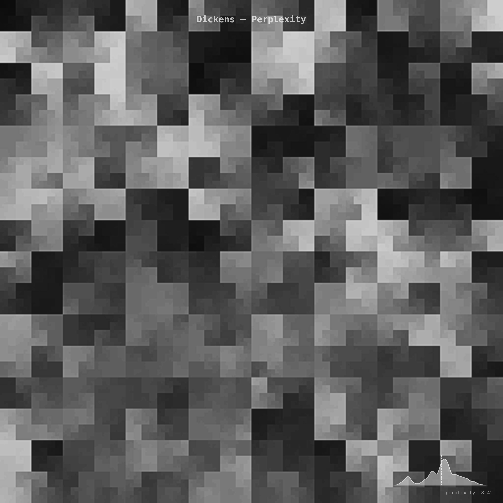
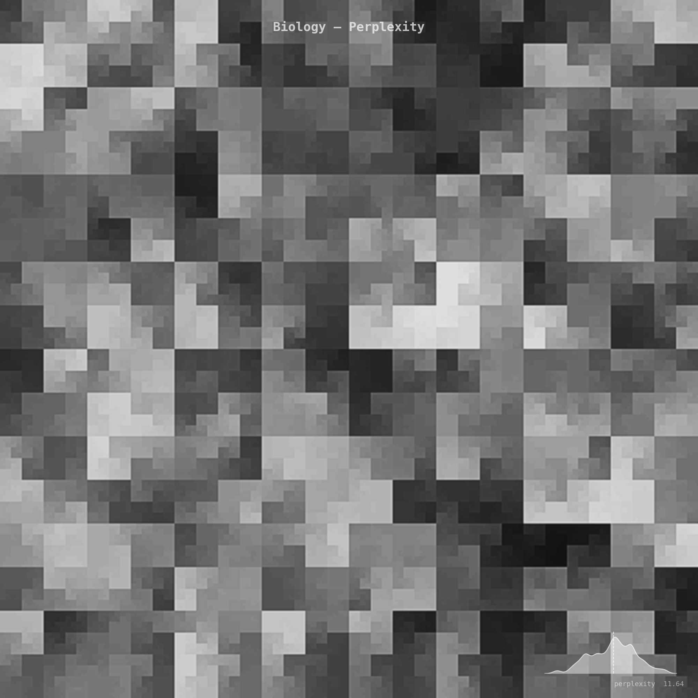
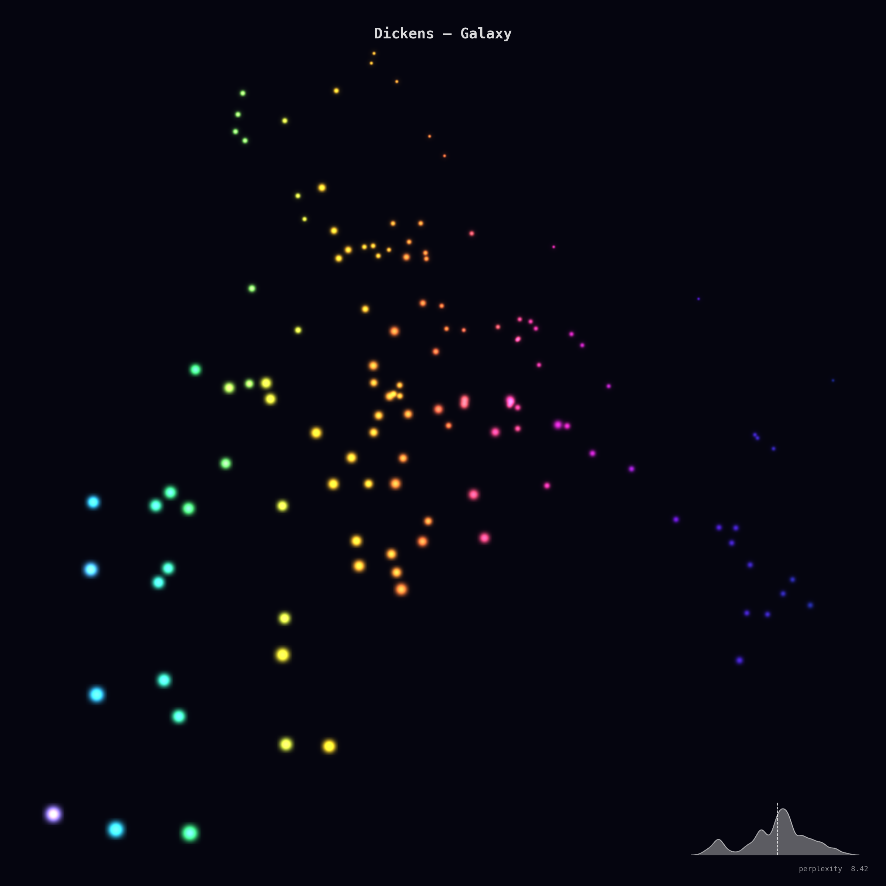
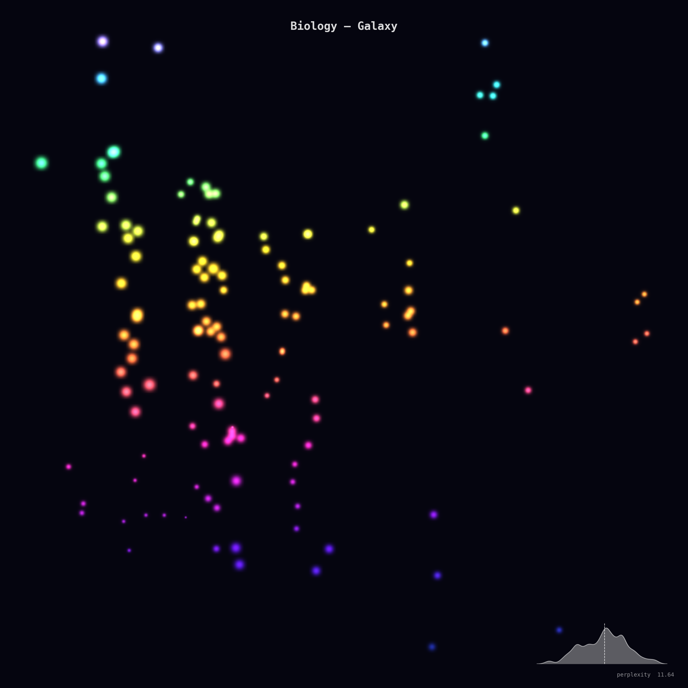

# perplexFern 🌿

Visualise the complexity of natural text as a data-driven fractal.

Feed in **any text** — a raw string, a `.txt` file, a `.json` document, or a `.csv` spreadsheet — and perplexFern will:

1. **Compute** a chosen metric (perplexity, entropy, TTR, …) over sliding windows at multiple scales.
2. **Map** the blended signal onto a square image via a **Hilbert space-filling curve**.
3. **Return** a high-resolution, black-and-white fractal whose structure emerges from the statistical self-similarity of the language itself.

Every text produces a *different* image.
Repetitive, low-perplexity text yields bright, sparse, smooth patterns;
dense, high-perplexity text produces dark, intricate, fine-grained textures.

| Dickens (low perplexity) | Biology (high perplexity) |
|:---:|:---:|
|  |  |

---

## Installation

```bash
pip install -e .
```

**Dependencies:** `numpy ≥ 1.24`, `matplotlib ≥ 3.7` — no other libraries required.

## Quick start

```python
import perplexfern

# From a raw string
fig = perplexfern.analyse(
    "The quick brown fox jumps over the lazy dog. "
    "Pack my box with five dozen liquor jugs.",
    save_path="fractal.png",
)

# From a file
fig = perplexfern.analyse("path/to/essay.txt", save_path="essay.png")
```

## Metrics only (no plot)

```python
m = perplexfern.analyse_metrics("Some interesting paragraph...")
print(m.summary())
```

Output example:

```
── Text Metrics ──
          perplexity: 12.3456
             entropy: 4.5678
                 ttr: 0.7200
               hapax: 0.5100
        char_entropy: 3.9012
    mean_word_length: 4.8300
             n_chars: 1024
             n_words: 200
      n_unique_words: 144
```

## Step-by-step API

```python
from perplexfern import (
    parse, compute_windowed, compute_summary,
    multi_scale_image, render, AVAILABLE_METRICS,
)

text   = parse("data.csv")                    # extract text from any format
signal = compute_windowed(text, metric="entropy")  # 1-D windowed metric
stats  = compute_summary(text)                # global TextMetrics dataclass

# Build the fractal image (returns a 2-D numpy array, values in [0, 1])
image  = multi_scale_image(
    text,
    AVAILABLE_METRICS["entropy"],
    order=9,          # 2^9 = 512 → 512×512 image
    n_octaves=6,
    persistence=0.55,
    detail_boost=0.6,
)

fig = render(image, save_path="output.png")
```

## Available metrics

| Key | Description |
|---|---|
| `perplexity` | Character-level bigram perplexity (Laplace-smoothed) |
| `entropy` | Shannon entropy over the word distribution (bits) |
| `ttr` | Type-token ratio (unique words / total words) |
| `word_length` | Mean word length |
| `hapax` | Hapax ratio — proportion of words appearing exactly once |
| `char_entropy` | Shannon entropy over individual characters (bits) |

Pass any of these as the `metric` parameter to `analyse()` or use them directly via `AVAILABLE_METRICS`.

## `analyse()` parameters

| Parameter | Default | Description |
|---|---|---|
| `source` | — | Raw text string or path to `.txt` / `.json` / `.csv` |
| `metric` | `"perplexity"` | Which metric to visualise |
| `order` | `9` | Hilbert-curve order → image is `2^order × 2^order` pixels |
| `n_octaves` | `6` | Number of scale layers to blend |
| `persistence` | `0.55` | Amplitude decay per octave (0–1) |
| `detail_boost` | `0.6` | Laplacian edge-enhancement strength (0 = off) |
| `invert` | `False` | Swap black and white |
| `save_path` | `None` | Save the figure to this path |
| `title` | `None` | Title overlaid on the image |
| `size` | `10` | Figure side length (inches) |
| `dpi` | `200` | Output resolution |

## How the fractal works

1. **Multi-scale windowed metrics** — the chosen metric is computed at
   progressively smaller window sizes (octaves), producing several 1-D signals
   from coarse to fine.

2. **Hilbert-curve mapping** — each 1-D signal is resampled to fill a
   `2^order × 2^order` grid via a Hilbert space-filling curve, which preserves
   locality (nearby windows → nearby pixels).

3. **Octave blending** — layers are combined like fractal Brownian motion:
   large scales set the overall tone, fine scales add intricate detail.
   Persistence controls how fast the detail falls off.

4. **Intensity-anchored tone mapping** — the absolute level of the metric
   drives a gamma + sigmoid contrast curve, so that low-metric and high-metric
   texts look visually distinct at a glance.

5. **Adaptive histogram equalization (CLAHE)** — spreads the tonal range so
   subtle structure becomes visible.

6. **Laplacian detail enhancement** — a sharpening pass makes edges and
   texture pop.

7. **KDE sparkline overlay** — a Gaussian kernel-density estimate of the
   windowed metric values is drawn as a small distribution curve in the
   bottom-right corner, along with the global metric value.

---

## Galaxy mode – colour point-cloud

A second visualization style inspired by the
[Open Syllabus Galaxy](https://galaxy.opensyllabus.org/): a colour-splashed
scatter plot on a dark background where clusters of glowing points reveal the
structure of the text.

| Dickens | Biology |
|:---:|:---:|
|  |  |

```python
fig = perplexfern.analyse_galaxy(
    "Your text here …",
    save_path="galaxy.png",
)
```

### How it works

1. **All six metrics** are computed simultaneously over sliding windows,
   producing a small feature vector per window.
2. **PCA** projects these vectors into 2-D so similarly-scored windows cluster
   together.
3. Each point is **coloured** by one metric (default: perplexity) and **sized**
   by another (default: entropy) using a neon palette on a near-black canvas.
4. Points are drawn as **Gaussian splats** with additive blending, creating the
   characteristic glowing-cluster effect.
5. An optional **bloom pass** adds a soft halo around bright regions.

### `analyse_galaxy()` parameters

| Parameter | Default | Description |
|---|---|---|
| `source` | — | Raw text or path to `.txt` / `.json` / `.csv` |
| `color_metric` | `"perplexity"` | Metric that drives point colour |
| `size_metric` | `"entropy"` | Metric that drives point radius |
| `resolution` | `2048` | Canvas side length in pixels |
| `point_size` | `1.0` | Base point radius multiplier |
| `palette` | `"galaxy"` | `"galaxy"` (neon) or any matplotlib colormap |
| `glow` | `6.0` | Gaussian bloom radius (0 = off) |
| `save_path` | `None` | Save the figure here |
| `title` | `None` | Title overlaid on the image |
| `size` | `12` | Figure side length (inches) |
| `dpi` | `200` | Output resolution |

### Step-by-step

```python
from perplexfern import (
    parse, galaxy_points, galaxy_image,
    AVAILABLE_METRICS,
)
from perplexfern.galaxy_viz import render_galaxy

text = parse("data.csv")
metric_dict = {n: f for n, f in sorted(AVAILABLE_METRICS.items())}

positions, features = galaxy_points(text, metric_dict)
image = galaxy_image(
    positions, features, list(metric_dict.keys()),
    color_metric="entropy",
    palette="galaxy",
    resolution=2048,
    glow_sigma=6.0,
)
fig = render_galaxy(image, save_path="galaxy.png")
```

---

## Example

```python
"""Compare Dickens prose vs. Biology textbook."""
import perplexfern

dickens = "It was the best of times, it was the worst of times, ..." * 12
biology = "Adenosine triphosphate serves as the primary energy ..." * 8

# B&W Hilbert fractal
perplexfern.analyse(dickens, title="Dickens", save_path="fractal_dickens.png")
perplexfern.analyse(biology, title="Biology", save_path="fractal_biology.png")

# Colour galaxy scatter
perplexfern.analyse_galaxy(dickens, title="Dickens", save_path="galaxy_dickens.png")
perplexfern.analyse_galaxy(biology, title="Biology", save_path="galaxy_biology.png")
```

The Dickens image will appear **brighter and smoother** (low perplexity,
repetitive structure), while the Biology image will be **darker and more
intricate** (high perplexity, dense technical vocabulary).

In galaxy mode the Dickens text forms **tight, uniform clusters** (few
distinct metric combinations) while the Biology text scatters into a **wider,
more colourful cloud** with greater diversity of point colours and sizes.

## License

MIT
